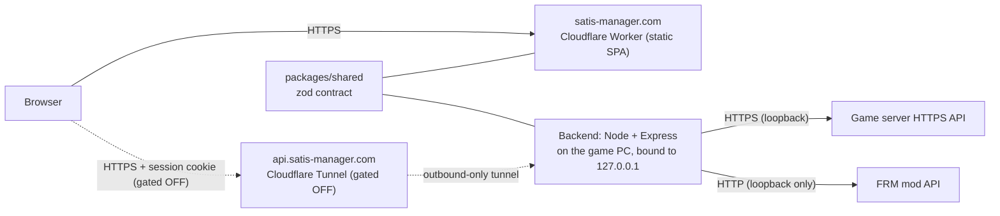

# Project Case-Study Pages Implementation Plan

> **For agentic workers:** REQUIRED SUB-SKILL: Use superpowers:subagent-driven-development (recommended) or superpowers:executing-plans to implement this plan task-by-task. Steps use checkbox (`- [ ]`) syntax for tracking.

**Goal:** Add per-project case-study pages (`/projects/<slug>`) to the portfolio site, starting with `satisfactory-dash`, plus a compact card for the newly-public `local-worker` project — without adding a runtime router library, a runtime markdown parser, or a runtime Mermaid renderer.

**Architecture:** A ~100-line hand-written router (History API + React context) replaces the single static page with two route shapes. Case-study prose lives in markdown files, converted to static HTML at build/dev time by a tiny Node script using `marked`; the browser only ever receives plain HTML. The Mermaid architecture diagram is rendered once, outside the app, to a committed SVG referenced as a plain image.

**Tech Stack:** React 19, TypeScript, Vite 8, Vitest 5 + Testing Library, `marked` (new dependency, HTML generation only, dev-time).

**Spec:** `docs/superpowers/specs/2026-09-23-project-case-study-pages-design.md`

## Global Constraints

- No new runtime dependency for routing or markdown parsing — `marked` runs only in the Node build/dev script, never imported into browser-bundled code.
- No `@mermaid-js/mermaid-cli` (or any Mermaid package) added to `package.json` — the SVG is generated once via `npx` (ephemeral) and committed as a static asset.
- Every interactive element (case-study links, back-to-home link, diagram disclosure) must be a real, focusable, keyboard-operable element (`<a>`, `<details>/<summary>`) — no `onClick`-only `<div>`s.
- Heading order per page: exactly one `<h1>` (the project name on `/projects/:slug`, or the existing page structure on `/`), `<h2>` for each case-study section, no skipped levels.
- No personal data beyond what the site already publishes (per CLAUDE.md ground rule 3): the case-study content and `local-worker` blurb must not introduce a phone number, a second personal email, or a local filesystem path.
- Every one of the satisfactory-dash draft's 16 HTML-comment citations must be checked against the real `satisfactory-dash` repo before the comments are stripped; a citation that doesn't check out gets fixed or the claim cut, never published unverified.
- `git ls-files` in `leonardo-nunez-portfolio` must never include `src/content/case-studies/generated/` (build output, not source).

## Review Focus

- **A slug in the URL that matches no project** (e.g. `/projects/does-not-exist`) — expected: a small "not found" page with a working link home, not a crash or a blank screen.
- **Browser back/forward after navigating to a case study** — expected: the URL and rendered page both update; a naive router that only handles clicks (no `popstate` listener) would get this wrong.
- **A direct hard-reload on `/projects/satisfactory-dash`** (not client-side navigation) — expected: Cloudflare Pages' SPA fallback serves the app, which then renders the right project; this is infrastructure behavior the plan must verify against the real preview URL, not assume.
- **The case-study markdown containing raw HTML for the diagram's image + `<details>` block** — expected: `marked`'s default (non-sanitizing) config passes it through untouched; a config that sanitizes HTML would silently strip the accessible diagram markup.
- **A modified click (Cmd/Ctrl/Shift/middle-click) on a case-study link** — expected: the browser's native "open in new tab/window" behavior still works; a router that unconditionally calls `preventDefault()` on every click would break this.

---

## File Structure

**New:**
- `src/router/Router.tsx` — `RouterProvider`, `useRouter()` (path state, `navigate()`, `popstate` sync)
- `src/router/Link.tsx` — anchor wrapper that intercepts plain left-clicks only
- `src/router/matchProjectSlug.ts` — pure path-matching helper
- `src/router/router.test.tsx` — tests for the three files above
- `src/pages/Home.tsx` — the current one-page layout, moved out of `App.tsx` unchanged
- `src/pages/ProjectDetail.tsx` — case-study page (header + generated body HTML)
- `src/pages/ProjectDetail.test.tsx`
- `src/components/ProjectCard.tsx` — extracted from `Projects.tsx`, adds case-study link + compact variant
- `src/components/ProjectCard.test.tsx`
- `src/content/case-studies/index.ts` — `getCaseStudyHtml(slug)` loader over the generated modules
- `src/content/case-studies/satisfactory-dash.md` — published (citation-free) case-study content
- `scripts/markdownToHtml.mjs` — pure `markdownToHtml(markdown) -> string` wrapper around `marked`
- `scripts/markdownToHtml.test.mjs` — Vitest test for the pure function
- `scripts/generate-case-studies.mjs` — reads `src/content/case-studies/*.md`, writes `generated/<slug>.ts`
- `public/diagrams/satisfactory-dash-architecture.svg` — pre-rendered diagram
- `public/diagrams/satisfactory-dash-architecture.mmd` — Mermaid source, for future regeneration only

**Modified:**
- `src/App.tsx` — becomes the router shell (was the whole page)
- `src/components/Projects.tsx` — renders `<ProjectCard>` per project instead of inline markup
- `src/data/projects.ts` — add `slug?`/`emphasis?` fields; add `slug` to the satisfactory-dash entry; add the `local-worker` entry
- `package.json` — add `marked` dependency; add `predev`/`prebuild` scripts
- `.gitignore` — ignore `src/content/case-studies/generated/`
- `src/index.css` — styles for the case-study article, compact card, back link, diagram figure/details

---

### Task 1: Router primitives

**Files:**
- Create: `src/router/Router.tsx`
- Create: `src/router/Link.tsx`
- Create: `src/router/matchProjectSlug.ts`
- Test: `src/router/router.test.tsx`

**Interfaces:**
- Produces: `RouterProvider({ children }): JSX.Element`, `useRouter(): { path: string; navigate: (to: string) => void }`, `Link` component with a required `to: string` prop plus all normal `<a>` props, `matchProjectSlug(path: string): string | null`

- [ ] **Step 1: Write the failing tests**

```tsx
// src/router/router.test.tsx
import { render, screen, fireEvent } from "@testing-library/react";
import { describe, it, expect, beforeEach } from "vitest";
import { RouterProvider, useRouter } from "./Router";
import { Link } from "./Link";
import { matchProjectSlug } from "./matchProjectSlug";

function LocationProbe() {
  const { path } = useRouter();
  return <p data-testid="path">{path}</p>;
}

beforeEach(() => {
  window.history.pushState(null, "", "/");
});

describe("matchProjectSlug", () => {
  it("extracts the slug from a project detail path", () => {
    expect(matchProjectSlug("/projects/satisfactory-dash")).toBe("satisfactory-dash");
  });

  it("returns null for the home path", () => {
    expect(matchProjectSlug("/")).toBeNull();
  });

  it("returns null for an unrelated path", () => {
    expect(matchProjectSlug("/about")).toBeNull();
  });
});

describe("RouterProvider / useRouter", () => {
  it("exposes the current path on mount", () => {
    window.history.pushState(null, "", "/projects/satisfactory-dash");
    render(
      <RouterProvider>
        <LocationProbe />
      </RouterProvider>,
    );
    expect(screen.getByTestId("path")).toHaveTextContent("/projects/satisfactory-dash");
  });

  it("updates path on browser back/forward (popstate)", () => {
    render(
      <RouterProvider>
        <LocationProbe />
      </RouterProvider>,
    );
    window.history.pushState(null, "", "/projects/satisfactory-dash");
    fireEvent.popState(window);
    expect(screen.getByTestId("path")).toHaveTextContent("/projects/satisfactory-dash");
  });
});

describe("Link", () => {
  it("navigates on a plain left-click without a full page load", () => {
    render(
      <RouterProvider>
        <Link to="/projects/satisfactory-dash">Read case study</Link>
        <LocationProbe />
      </RouterProvider>,
    );
    fireEvent.click(screen.getByText("Read case study"), { button: 0 });
    expect(screen.getByTestId("path")).toHaveTextContent("/projects/satisfactory-dash");
    expect(window.location.pathname).toBe("/projects/satisfactory-dash");
  });

  it("does not intercept a modified click (lets the browser open a new tab)", () => {
    render(
      <RouterProvider>
        <Link to="/projects/satisfactory-dash">Read case study</Link>
        <LocationProbe />
      </RouterProvider>,
    );
    fireEvent.click(screen.getByText("Read case study"), { button: 0, metaKey: true });
    expect(screen.getByTestId("path")).toHaveTextContent("/");
  });

  it("renders a real anchor with a real href", () => {
    render(
      <RouterProvider>
        <Link to="/projects/satisfactory-dash">Read case study</Link>
      </RouterProvider>,
    );
    expect(screen.getByRole("link", { name: "Read case study" })).toHaveAttribute(
      "href",
      "/projects/satisfactory-dash",
    );
  });
});
```

- [ ] **Step 2: Run the tests to verify they fail**

Run: `npm run test -- src/router/router.test.tsx`
Expected: FAIL — `./Router`, `./Link`, `./matchProjectSlug` don't exist yet.

- [ ] **Step 3: Implement `matchProjectSlug`**

```ts
// src/router/matchProjectSlug.ts
export function matchProjectSlug(path: string): string | null {
  const match = /^\/projects\/([a-z0-9-]+)\/?$/.exec(path);
  return match ? match[1] : null;
}
```

- [ ] **Step 4: Implement `Router.tsx`**

```tsx
// src/router/Router.tsx
import { createContext, useContext, useEffect, useState, type ReactNode } from "react";

interface RouterContextValue {
  path: string;
  navigate: (to: string) => void;
}

const RouterContext = createContext<RouterContextValue | null>(null);

export function RouterProvider({ children }: { children: ReactNode }) {
  const [path, setPath] = useState(() => window.location.pathname);

  useEffect(() => {
    const onPopState = () => setPath(window.location.pathname);
    window.addEventListener("popstate", onPopState);
    return () => window.removeEventListener("popstate", onPopState);
  }, []);

  const navigate = (to: string) => {
    window.history.pushState(null, "", to);
    setPath(to);
  };

  return <RouterContext.Provider value={{ path, navigate }}>{children}</RouterContext.Provider>;
}

export function useRouter(): RouterContextValue {
  const ctx = useContext(RouterContext);
  if (!ctx) {
    throw new Error("useRouter must be used within a RouterProvider");
  }
  return ctx;
}
```

- [ ] **Step 5: Implement `Link.tsx`**

```tsx
// src/router/Link.tsx
import type { AnchorHTMLAttributes, MouseEvent } from "react";
import { useRouter } from "./Router";

interface LinkProps extends AnchorHTMLAttributes<HTMLAnchorElement> {
  to: string;
}

export function Link({ to, onClick, children, ...rest }: LinkProps) {
  const { navigate } = useRouter();

  const handleClick = (event: MouseEvent<HTMLAnchorElement>) => {
    onClick?.(event);
    if (event.defaultPrevented) return;
    const isModified =
      event.button !== 0 || event.metaKey || event.ctrlKey || event.shiftKey || event.altKey;
    if (isModified) return;
    event.preventDefault();
    navigate(to);
  };

  return (
    <a href={to} onClick={handleClick} {...rest}>
      {children}
    </a>
  );
}
```

- [ ] **Step 6: Run the tests to verify they pass**

Run: `npm run test -- src/router/router.test.tsx`
Expected: PASS (8 tests)

- [ ] **Step 7: Typecheck and lint**

Run: `npm run typecheck && npm run lint`
Expected: no errors

- [ ] **Step 8: Commit**

```bash
git add src/router/
git commit -m "Add minimal router primitives (Router, Link, matchProjectSlug)"
```

---

### Task 2: Wire the router into App; extract Home

**Files:**
- Create: `src/pages/Home.tsx`
- Modify: `src/App.tsx`
- Modify: `src/App.test.tsx` (add route-matching coverage; existing tests must keep passing unmodified)

**Interfaces:**
- Consumes: `RouterProvider`, `useRouter` from `src/router/Router.tsx`; `matchProjectSlug` from `src/router/matchProjectSlug.ts` (Task 1)
- Produces: `Home` component (default export removed from `App.tsx`'s old body, now its own named export) that later tasks don't depend on directly (only `App.tsx` renders it)

- [ ] **Step 1: Create `Home.tsx` from the current `App.tsx` body**

```tsx
// src/pages/Home.tsx
import { Header } from "../components/Header";
import { Hero } from "../components/Hero";
import { About } from "../components/About";
import { Skills } from "../components/Skills";
import { Projects } from "../components/Projects";
import { Contact } from "../components/Contact";
import { Footer } from "../components/Footer";

export function Home() {
  return (
    <>
      <Header />
      <main>
        <Hero />
        <About />
        <Projects />
        <Skills />
        <Contact />
      </main>
      <Footer />
    </>
  );
}
```

- [ ] **Step 2: Rewrite `App.tsx` as the router shell**

```tsx
// src/App.tsx
import { RouterProvider, useRouter } from "./router/Router";
import { matchProjectSlug } from "./router/matchProjectSlug";
import { Home } from "./pages/Home";
import { ProjectDetail } from "./pages/ProjectDetail";

function AppRoutes() {
  const { path } = useRouter();
  const slug = matchProjectSlug(path);
  if (slug) {
    return <ProjectDetail slug={slug} />;
  }
  return <Home />;
}

function App() {
  return (
    <RouterProvider>
      <AppRoutes />
    </RouterProvider>
  );
}

export default App;
```

Note: this references `./pages/ProjectDetail`, created in Task 7. To keep this task independently testable now, stub it first:

```tsx
// src/pages/ProjectDetail.tsx (temporary stub, replaced in full in Task 7)
export function ProjectDetail({ slug }: { slug: string }) {
  return <p>Case study: {slug}</p>;
}
```

- [ ] **Step 3: Add route-matching coverage to `App.test.tsx`**

```tsx
// src/App.test.tsx — add below the existing two tests, inside the same describe block
it("renders the project detail stub at a /projects/:slug path", () => {
  window.history.pushState(null, "", "/projects/satisfactory-dash");
  render(<App />);
  expect(screen.getByText(/Case study: satisfactory-dash/i)).toBeInTheDocument();
  window.history.pushState(null, "", "/");
});
```

(The two existing tests are untouched — jsdom's default URL path is `/`, so `Home` still renders at the default location.)

- [ ] **Step 4: Run the full test suite**

Run: `npm run test`
Expected: PASS — all `App.test.tsx` tests, including the new one.

- [ ] **Step 5: Typecheck, lint, build**

Run: `npm run typecheck && npm run lint && npm run build`
Expected: no errors (the stub `ProjectDetail` is enough for the build to succeed)

- [ ] **Step 6: Commit**

```bash
git add src/App.tsx src/App.test.tsx src/pages/Home.tsx src/pages/ProjectDetail.tsx
git commit -m "Wire router into App; extract Home page"
```

---

### Task 3: Extend the Project data model; add local-worker

**Files:**
- Modify: `src/data/projects.ts`

**Interfaces:**
- Produces: `Project` interface gains `slug?: string` and `emphasis?: "primary" | "secondary"`, consumed by `ProjectCard` (Task 4) and `ProjectDetail` (Task 7)

- [ ] **Step 1: Extend the interface and update the satisfactory-dash entry**

```ts
// src/data/projects.ts — interface change
export interface Project {
  name: string;
  description: string;
  status: "in-progress" | "shipped";
  stack: string[];
  repoUrl?: string;
  liveUrl?: string;
  slug?: string;
  emphasis?: "primary" | "secondary";
}
```

Add `slug: "satisfactory-dash"` to the existing `satisfactory-dash` entry (leave every other field on that entry unchanged — `status`/`liveUrl` are a separate decision, out of scope here).

- [ ] **Step 2: Add the `local-worker` entry**

Append to the `projects` array (after `satisfactory-dash`, before `Home Lab`, so the two most substantial entries lead):

```ts
  {
    name: "local-worker",
    description:
      "An MCP server that offloads bulk reading (CI logs, diffs, long docs) and first drafts to a local Ollama model on the GPU, so large inputs never enter Claude's context — plus Markdown-to-PDF rendering and a weekly devlog CLI. 233 tests, CI on Ubuntu and Windows, with path confinement hardened through an independent bug hunt and two security reviews.",
    status: "shipped",
    stack: ["TypeScript", "Node.js", "MCP", "Ollama", "Vitest"],
    repoUrl: "https://github.com/Sour-Dev-Home/local-worker",
    emphasis: "secondary",
  },
```

- [ ] **Step 3: Typecheck**

Run: `npm run typecheck`
Expected: no errors

- [ ] **Step 4: Run the existing test suite**

Run: `npm run test`
Expected: PASS — `App.test.tsx`'s "at least one project with a working repo link" test still finds `satisfactory-dash`'s repo link (first match).

- [ ] **Step 5: Commit**

```bash
git add src/data/projects.ts
git commit -m "Add slug/emphasis fields; link satisfactory-dash's case study; add local-worker"
```

---

### Task 4: Extract ProjectCard with case-study link and compact variant

**Files:**
- Create: `src/components/ProjectCard.tsx`
- Create: `src/components/ProjectCard.test.tsx`
- Modify: `src/components/Projects.tsx`

**Interfaces:**
- Consumes: `Project` type and `project.slug`/`project.emphasis` (Task 3); `Link` from `src/router/Link.tsx` (Task 1)
- Produces: `ProjectCard({ project: Project }): JSX.Element`, used by `Projects.tsx`

- [ ] **Step 1: Write the failing tests**

```tsx
// src/components/ProjectCard.test.tsx
import { render, screen } from "@testing-library/react";
import { describe, it, expect } from "vitest";
import { RouterProvider } from "../router/Router";
import { ProjectCard } from "./ProjectCard";
import type { Project } from "../data/projects";

const baseProject: Project = {
  name: "Test Project",
  description: "A project for testing.",
  status: "shipped",
  stack: ["React", "TypeScript"],
  repoUrl: "https://github.com/example/test-project",
};

function renderCard(project: Project) {
  return render(
    <RouterProvider>
      <ProjectCard project={project} />
    </RouterProvider>,
  );
}

describe("ProjectCard", () => {
  it("renders the name, description, and stack chips", () => {
    renderCard(baseProject);
    expect(screen.getByRole("heading", { name: "Test Project" })).toBeInTheDocument();
    expect(screen.getByText("A project for testing.")).toBeInTheDocument();
    expect(screen.getByText("React")).toBeInTheDocument();
  });

  it("shows a case-study link only when a slug is present", () => {
    renderCard(baseProject);
    expect(screen.queryByText(/read case study/i)).not.toBeInTheDocument();

    renderCard({ ...baseProject, slug: "test-project" });
    const link = screen.getByRole("link", { name: /read case study/i });
    expect(link).toHaveAttribute("href", "/projects/test-project");
  });

  it("applies a compact class when emphasis is secondary", () => {
    const { container } = renderCard({ ...baseProject, emphasis: "secondary" });
    expect(container.querySelector(".project-card-compact")).toBeInTheDocument();
  });

  it("does not apply the compact class by default", () => {
    const { container } = renderCard(baseProject);
    expect(container.querySelector(".project-card-compact")).not.toBeInTheDocument();
  });
});
```

- [ ] **Step 2: Run the tests to verify they fail**

Run: `npm run test -- src/components/ProjectCard.test.tsx`
Expected: FAIL — `./ProjectCard` doesn't exist yet.

- [ ] **Step 3: Implement `ProjectCard.tsx`**

```tsx
// src/components/ProjectCard.tsx
import type { Project } from "../data/projects";
import { Link } from "../router/Link";

interface ProjectCardProps {
  project: Project;
}

export function ProjectCard({ project }: ProjectCardProps) {
  const isCompact = project.emphasis === "secondary";

  return (
    <article className={isCompact ? "project-card project-card-compact" : "project-card"}>
      <div className="project-card-header">
        <h3>{project.name}</h3>
        {project.status === "in-progress" && <span className="badge">In progress</span>}
      </div>
      <p>{project.description}</p>
      <ul className="stack-list">
        {project.stack.map((tech) => (
          <li key={tech}>{tech}</li>
        ))}
      </ul>
      {(project.repoUrl || project.liveUrl || project.slug) && (
        <div className="project-links">
          {project.slug && <Link to={`/projects/${project.slug}`}>Read case study →</Link>}
          {project.repoUrl && (
            <a href={project.repoUrl} target="_blank" rel="noreferrer">
              Repo
            </a>
          )}
          {project.liveUrl && (
            <a href={project.liveUrl} target="_blank" rel="noreferrer">
              Live demo
            </a>
          )}
        </div>
      )}
    </article>
  );
}
```

- [ ] **Step 4: Update `Projects.tsx` to use it**

```tsx
// src/components/Projects.tsx
import { projects } from "../data/projects";
import { ProjectCard } from "./ProjectCard";

export function Projects() {
  return (
    <section id="projects" className="section">
      <h2>Projects</h2>
      <div className="projects-grid">
        {projects.map((project) => (
          <ProjectCard key={project.name} project={project} />
        ))}
      </div>
    </section>
  );
}
```

- [ ] **Step 5: Run the tests to verify they pass**

Run: `npm run test`
Expected: PASS, including `App.test.tsx` (Projects still renders through the same DOM shape) and the new `ProjectCard.test.tsx`.

- [ ] **Step 6: Typecheck, lint**

Run: `npm run typecheck && npm run lint`
Expected: no errors

- [ ] **Step 7: Commit**

```bash
git add src/components/ProjectCard.tsx src/components/ProjectCard.test.tsx src/components/Projects.tsx
git commit -m "Extract ProjectCard component with case-study link and compact variant"
```

---

### Task 5: Content pipeline (markdown → static HTML at build/dev time)

**Files:**
- Create: `scripts/markdownToHtml.mjs`
- Create: `scripts/markdownToHtml.test.mjs`
- Create: `scripts/generate-case-studies.mjs`
- Create: `src/content/case-studies/index.ts`
- Modify: `package.json`
- Modify: `.gitignore`

**Interfaces:**
- Produces: `markdownToHtml(markdown: string): string` (pure, tested); `getCaseStudyHtml(slug: string): string | null` (consumed by `ProjectDetail`, Task 7); an `npm run build`/`npm run dev` side effect that populates `src/content/case-studies/generated/*.ts`

- [ ] **Step 1: Install `marked`**

Run: `npm install marked`
Expected: `marked` appears under `dependencies` in `package.json` (it's imported by a script that runs at build time, not by browser code, but it's a real runtime dependency of the Node process running that script — `devDependencies` would also work; either is acceptable, pick `dependencies` for simplicity since no dependency-audit step in this repo currently distinguishes them for this kind of tooling).

- [ ] **Step 2: Write the failing test for the pure conversion function**

```js
// scripts/markdownToHtml.test.mjs
import { describe, it, expect } from "vitest";
import { markdownToHtml } from "./markdownToHtml.mjs";

describe("markdownToHtml", () => {
  it("converts a heading and paragraph", () => {
    const html = markdownToHtml("## Hello\n\nWorld.");
    expect(html).toContain("<h2>Hello</h2>");
    expect(html).toContain("<p>World.</p>");
  });

  it("passes raw HTML through untouched (needed for the accessible diagram block)", () => {
    const html = markdownToHtml('<details>\n<summary>More</summary>\n<p>Detail.</p>\n</details>');
    expect(html).toContain("<details>");
    expect(html).toContain("<summary>More</summary>");
  });

  it("converts a markdown image to a plain img tag", () => {
    const html = markdownToHtml("");
    expect(html).toContain('');
  });
});
```

- [ ] **Step 3: Run the test to verify it fails**

Run: `npm run test -- scripts/markdownToHtml.test.mjs`
Expected: FAIL — `./markdownToHtml.mjs` doesn't exist yet.

- [ ] **Step 4: Implement the pure function**

```js
// scripts/markdownToHtml.mjs
import { marked } from "marked";

export function markdownToHtml(markdown) {
  return marked.parse(markdown, { async: false });
}
```

- [ ] **Step 5: Run the test to verify it passes**

Run: `npm run test -- scripts/markdownToHtml.test.mjs`
Expected: PASS (3 tests)

- [ ] **Step 6: Implement the file-system wrapper script**

```js
// scripts/generate-case-studies.mjs
import { readdirSync, readFileSync, writeFileSync, mkdirSync, existsSync } from "node:fs";
import { join, basename, extname } from "node:path";
import { markdownToHtml } from "./markdownToHtml.mjs";

const SRC_DIR = join(process.cwd(), "src/content/case-studies");
const OUT_DIR = join(SRC_DIR, "generated");

function generate() {
  if (!existsSync(SRC_DIR)) return;
  mkdirSync(OUT_DIR, { recursive: true });
  const files = readdirSync(SRC_DIR).filter((file) => extname(file) === ".md");
  for (const file of files) {
    const slug = basename(file, ".md");
    const markdown = readFileSync(join(SRC_DIR, file), "utf-8");
    const html = markdownToHtml(markdown);
    writeFileSync(join(OUT_DIR, `${slug}.ts`), `export const html = ${JSON.stringify(html)};\n`);
  }
}

generate();
```

- [ ] **Step 7: Wire it into npm scripts**

```json
// package.json — add these two script entries (alongside the existing "dev" and "build")
"predev": "node scripts/generate-case-studies.mjs",
"prebuild": "node scripts/generate-case-studies.mjs",
```

npm runs `predev`/`prebuild` automatically before `dev`/`build` when invoked via `npm run dev` / `npm run build` — no change needed to the `dev`/`build` script bodies themselves.

- [ ] **Step 8: Ignore generated output**

```gitignore
# .gitignore — append
src/content/case-studies/generated/
```

- [ ] **Step 9: Implement the loader used by `ProjectDetail`**

```ts
// src/content/case-studies/index.ts
const modules = import.meta.glob<{ html: string }>("./generated/*.ts", { eager: true });

export function getCaseStudyHtml(slug: string): string | null {
  const mod = modules[`./generated/${slug}.ts`];
  return mod ? mod.html : null;
}
```

This has no dedicated unit test (it's a two-line lookup over Vite's own `import.meta.glob`, exercised indirectly by `ProjectDetail.test.tsx` in Task 7, which requires the generation script to have run — Task 7's test setup step covers this).

- [ ] **Step 10: Verify the generation script runs end-to-end**

Run: `node scripts/generate-case-studies.mjs`
Expected: exits with no error. If `src/content/case-studies/` has no `.md` files yet (true until Task 8), no output is produced — this is expected and not a failure (the `if (!existsSync(SRC_DIR)) return;` guard, plus an empty `readdirSync` result, both no-op safely).

- [ ] **Step 11: Typecheck, lint**

Run: `npm run typecheck && npm run lint`
Expected: no errors

- [ ] **Step 12: Commit**

```bash
git add scripts/ src/content/case-studies/index.ts package.json package-lock.json .gitignore
git commit -m "Add markdown-to-static-HTML content pipeline for case studies"
```

---

### Task 6: Generate the satisfactory-dash architecture diagram SVG

**Files:**
- Create: `public/diagrams/satisfactory-dash-architecture.mmd`
- Create: `public/diagrams/satisfactory-dash-architecture.svg`

**Interfaces:**
- Produces: a static asset served at `/diagrams/satisfactory-dash-architecture.svg`, referenced by the case-study markdown (Task 8)

- [ ] **Step 1: Save the Mermaid source**



Write exactly this (the diagram from the coordinator's draft, already encoding the gated tunnel/backend as dashed edges) to `public/diagrams/satisfactory-dash-architecture.mmd` as plain text (no code-fence markers — just the Mermaid source itself).

- [ ] **Step 2: Render it to SVG**

Run: `npx @mermaid-js/mermaid-cli -i public/diagrams/satisfactory-dash-architecture.mmd -o public/diagrams/satisfactory-dash-architecture.svg`

This is a one-off, ephemeral `npx` invocation — it must **not** be added to `package.json` (Global Constraints). If `npx` can't reach the package or the sandboxed environment can't run its bundled Chromium, render the same `.mmd` content manually at https://mermaid.live instead, download the SVG, and save it to the same path — the deliverable is the SVG file, not the specific rendering method.

- [ ] **Step 3: Verify the SVG is valid and reasonably sized**

Run: `node -e "const fs=require('fs'); const s=fs.readFileSync('public/diagrams/satisfactory-dash-architecture.svg','utf-8'); if(!s.includes('<svg')) throw new Error('not an SVG'); console.log('OK,', s.length, 'bytes');"`
Expected: prints `OK, <n> bytes` with no error.

- [ ] **Step 4: Commit**

```bash
git add public/diagrams/
git commit -m "Add pre-rendered satisfactory-dash architecture diagram"
```

---

### Task 7: ProjectDetail page

**Files:**
- Modify: `src/pages/ProjectDetail.tsx` (replace the Task 2 stub)
- Create: `src/pages/ProjectDetail.test.tsx`
- Modify: `src/index.css` (case-study article + back-link + diagram styles)

**Interfaces:**
- Consumes: `projects` array + `Project` type (Task 3); `getCaseStudyHtml` (Task 5); `Link` (Task 1)
- Produces: `ProjectDetail({ slug: string }): JSX.Element`, rendered by `App.tsx` (Task 2)

- [ ] **Step 1: Write the failing tests**

These tests need a real generated case-study module to import from, so they seed one directly (bypassing the build script) rather than depending on Task 8's real content:

```tsx
// src/pages/ProjectDetail.test.tsx
import { render, screen } from "@testing-library/react";
import { describe, it, expect, vi } from "vitest";
import { RouterProvider } from "../router/Router";
import { ProjectDetail } from "./ProjectDetail";

vi.mock("../content/case-studies", () => ({
  getCaseStudyHtml: (slug: string) =>
    slug === "satisfactory-dash" ? "<h2>The problem</h2><p>Test body.</p>" : null,
}));

function renderDetail(slug: string) {
  return render(
    <RouterProvider>
      <ProjectDetail slug={slug} />
    </RouterProvider>,
  );
}

describe("ProjectDetail", () => {
  it("renders the project name as the page's h1", () => {
    renderDetail("satisfactory-dash");
    expect(screen.getByRole("heading", { level: 1, name: "satisfactory-dash" })).toBeInTheDocument();
  });

  it("renders the generated case-study HTML body", () => {
    renderDetail("satisfactory-dash");
    expect(screen.getByRole("heading", { level: 2, name: "The problem" })).toBeInTheDocument();
    expect(screen.getByText("Test body.")).toBeInTheDocument();
  });

  it("renders a working link back home", () => {
    renderDetail("satisfactory-dash");
    const backLink = screen.getByRole("link", { name: /back to all projects/i });
    expect(backLink).toHaveAttribute("href", "/");
  });

  it("renders a not-found state for an unknown slug, with no h1 mismatch", () => {
    renderDetail("does-not-exist");
    expect(screen.getByRole("heading", { level: 1, name: /not found/i })).toBeInTheDocument();
    expect(screen.getByRole("link", { name: /back home/i })).toHaveAttribute("href", "/");
  });
});
```

- [ ] **Step 2: Run the tests to verify they fail**

Run: `npm run test -- src/pages/ProjectDetail.test.tsx`
Expected: FAIL — the stub from Task 2 doesn't render any of this.

- [ ] **Step 3: Implement `ProjectDetail.tsx`**

```tsx
// src/pages/ProjectDetail.tsx
import { projects } from "../data/projects";
import { getCaseStudyHtml } from "../content/case-studies";
import { Header } from "../components/Header";
import { Footer } from "../components/Footer";
import { Link } from "../router/Link";

interface ProjectDetailProps {
  slug: string;
}

export function ProjectDetail({ slug }: ProjectDetailProps) {
  const project = projects.find((p) => p.slug === slug);

  if (!project) {
    return (
      <>
        <Header />
        <main>
          <section className="section">
            <h1>Project not found</h1>
            <p>
              <Link to="/">Back home</Link>
            </p>
          </section>
        </main>
        <Footer />
      </>
    );
  }

  const html = getCaseStudyHtml(slug) ?? "";

  return (
    <>
      <Header />
      <main>
        <article className="section case-study">
          <p className="case-study-back">
            <Link to="/">← Back to all projects</Link>
          </p>
          <h1>{project.name}</h1>
          <ul className="stack-list">
            {project.stack.map((tech) => (
              <li key={tech}>{tech}</li>
            ))}
          </ul>
          {(project.repoUrl || project.liveUrl) && (
            <div className="project-links">
              {project.repoUrl && (
                <a href={project.repoUrl} target="_blank" rel="noreferrer">
                  Repo
                </a>
              )}
              {project.liveUrl && (
                <a href={project.liveUrl} target="_blank" rel="noreferrer">
                  Live demo
                </a>
              )}
            </div>
          )}
          {/* eslint-disable-next-line react/no-danger -- content is our own build-time-generated HTML, never user input */}
          <div className="case-study-body" dangerouslySetInnerHTML={{ __html: html }} />
        </article>
      </main>
      <Footer />
    </>
  );
}
```

- [ ] **Step 4: Run the tests to verify they pass**

Run: `npm run test -- src/pages/ProjectDetail.test.tsx`
Expected: PASS (4 tests)

- [ ] **Step 5: Add case-study styles**

```css
/* src/index.css — append */
.case-study-back {
  margin-bottom: 1rem;
}

.case-study h1 {
  font-size: 2rem;
  margin: 0 0 0.75rem;
}

.case-study-body {
  margin-top: 1.5rem;
}

.case-study-body h2 {
  font-size: 1.3rem;
  margin: 2rem 0 0.75rem;
}

.case-study-body p,
.case-study-body li {
  color: var(--text-muted);
}

.case-study-body img {
  max-width: 100%;
  height: auto;
  border: 1px solid var(--border);
  border-radius: 8px;
}

.case-study-body details {
  margin: 0.75rem 0 1.5rem;
  border: 1px solid var(--border);
  border-radius: 8px;
  padding: 0.75rem 1rem;
}

.case-study-body summary {
  cursor: pointer;
  font-weight: 600;
}

.project-card-compact {
  padding: 1rem 1.5rem;
}

.project-card-compact .project-card-header h3 {
  font-size: 1rem;
}
```

- [ ] **Step 6: Run the full suite, typecheck, lint, build**

Run: `npm run test && npm run typecheck && npm run lint && npm run build`
Expected: all PASS

- [ ] **Step 7: Commit**

```bash
git add src/pages/ProjectDetail.tsx src/pages/ProjectDetail.test.tsx src/index.css
git commit -m "Implement ProjectDetail page with generated case-study body"
```

---

### Task 8: Publish the satisfactory-dash case-study content

**Files:**
- Create: `src/content/case-studies/satisfactory-dash.md`

**Interfaces:**
- Consumes: the content pipeline (Task 5) — this file is picked up automatically by `generate-case-studies.mjs` on the next `npm run dev`/`npm run build`
- Produces: the actual body rendered by `ProjectDetail` for `slug === "satisfactory-dash"`, replacing the mocked HTML the Task 7 tests used

The source draft is `../portfolio-drafts/satisfactory-dash-case-study.md` (outside every repo). It carries 16 HTML-comment citations. Verify each against the real `satisfactory-dash` repo before writing the published file — a citation that doesn't check out gets its claim fixed or cut, never shipped unverified (Global Constraints).

- [ ] **Step 1: Verify every citation**

For each citation below, confirm the referenced PR/ADR/file exists in `satisfactory-dash` and actually supports the claim next to it (e.g. `git -C ../satisfactory-dash log --all --oneline | grep -i "<topic>"`, reading the referenced ADR file directly, or `git -C ../satisfactory-dash show <ref>:<path>` for a file path):

1. FRM plain HTTP — `backend/src/modules/gameserver/frmApiClient.ts`; ADR-0013
2. Topology — ADR-0013 (amended: Workers static assets, `frontend/wrangler.jsonc`, PR #21); loopback bind — `backend/src/server.ts` (PR #25); FRM host guard — PR #17
3. ADR-0013 go-live gate; FRM guard PR #17; checklist issue #19
4. Server-scoped routes — ADR-0001
5. Zod contract — ADR-0002
6. Snapshot envelope with staleness — ADR-0004
7. Units verified against the live game — ADR-0006; captures — `docs-vault/raw-sources/captured-responses/`; bug fix + live numbers — PR #12
8. Login before exposure — ADR-0011; PRs #24, #29, #25
9. No database/cache until a trigger — ADR-0009, ADR-0010; measurement — PR #22
10. Contract-first sequencing — PRs #10, #11, #14 before #22/#18; ADR-0007
11. Auto-pause double-click bug — PR #39 description
12. Retroactive test sweep — PR #43
13. Security review findings — PR #29; issue #19
14. CI required checks — `.github/workflows/ci.yml` (verify); main ruleset: verify, fresh-eyes/test-hunter; PR #38
15. Leak-check PII fix — PR #9 (security check failed, then fixed); PR #40
16. Fourteen ADRs — `docs-vault/wiki/decisions/0001-0014`

Also re-check, at publish time rather than trusting the draft's wording:
- The actual current ADR count on `satisfactory-dash`'s `main` (the draft says "Fourteen" — confirm this is still accurate, or adjust the number/wording).
- Whether the MIT → AGPL-3.0 relicensing PR has merged (if so, the case study should not describe the project as MIT-licensed anywhere; if it hasn't merged, no change needed yet, but note it for a follow-up pass once it does).
- The live-API-offline note must stay accurate: confirm the tunnel is still gated (per `../DEPLOYMENT.md`'s "Tunnel gate" section) before publishing language that says so.

- [ ] **Step 2: Assemble the published markdown**

Starting from the draft, make these specific changes:
- Drop the top-level `# Satis Manager: ...` heading entirely (the page's own `<h1>` is the project name from `ProjectDetail`, per the Global Constraints' "exactly one h1" rule).
- Replace the ```` ```mermaid ... ``` ```` code fence under `## Architecture` with:
  ```html
  

  <details>
  <summary>Text description of this diagram</summary>
  <p>The browser reaches satis-manager.com over HTTPS, served by a Cloudflare Worker as static files. A dashed line shows the gated path: HTTPS plus a session cookie would reach api.satis-manager.com through an outbound-only Cloudflare Tunnel, currently switched off. That tunnel would carry requests to the backend, a Node and Express server running on the same PC as the game server, bound to localhost. The backend talks to the game server's HTTPS API and the FRM mod's HTTP API, both over loopback only. A shared zod-validated contract package sits between the frontend and backend so both sides agree on the shape of every request and response.</p>
  </details>
  ```
- Remove every `<!-- ... -->` HTML-comment citation from the body (they were a verification aid for Step 1, not reader-facing content — Global Constraints).
- Keep the "What's next" and "Links" sections as-is in structure (still `##` headings), applying any correction found in Step 1 (ADR count, license state).
- Keep the explicit "the API is intentionally offline until the go-live gate" note in the Links section exactly as the draft has it — do not drop it (Global Constraints references the coordinator's requirement here).

Write the result to `src/content/case-studies/satisfactory-dash.md`.

- [ ] **Step 3: Regenerate and inspect the output**

Run: `node scripts/generate-case-studies.mjs && node -e "console.log(require('fs').readFileSync('src/content/case-studies/generated/satisfactory-dash.ts','utf-8').slice(0,500))"`
Expected: prints the start of a generated `export const html = "...";` file whose content is HTML, starting with the "The problem" section (no leftover `#` markdown syntax, no HTML comments).

- [ ] **Step 4: Update `ProjectDetail.test.tsx`'s mock if section wording changed**

If Step 1/2 changed any heading text the existing mock-based tests (Task 7) don't reference directly, no change is needed — those tests use a mocked module, not this real content. Confirm this by re-running them:

Run: `npm run test -- src/pages/ProjectDetail.test.tsx`
Expected: PASS, unaffected by the real content (mock still in place).

- [ ] **Step 5: Full suite, typecheck, lint, build**

Run: `npm run test && npm run typecheck && npm run lint && npm run build`
Expected: all PASS

- [ ] **Step 6: Commit**

```bash
git add src/content/case-studies/satisfactory-dash.md
git commit -m "Publish satisfactory-dash case study (citations verified, then stripped)"
```

---

### Task 9: Manual QA against the deployed preview

**Files:** none (verification only — no code changes expected unless a check below fails, in which case fix forward and re-run this task's checks)

- [ ] **Step 1: Push the branch and open a PR**

```bash
git push -u origin feature/project-case-study-pages
```
Open a PR against `main` (GitHub web UI, since `gh` isn't authenticated in this environment). Wait for the `verify`, `security`, and CodeQL checks to pass, and for Cloudflare Pages to post a preview URL.

- [ ] **Step 2: Verify deep-link reload on the preview**

In Chrome, navigate directly to `<preview-url>/projects/satisfactory-dash` (typed/pasted, not clicked from within the app) and hard-reload it. Confirm the page renders the case study, not a 404 — this is the actual Cloudflare Pages SPA-fallback behavior, not an assumption (Review Focus).

- [ ] **Step 3: Verify navigation and back/forward**

From the preview's home page, click "Read case study" on the satisfactory-dash card, confirm the URL changes to `/projects/satisfactory-dash` without a full page reload, then use the browser's back button and confirm it returns to the home page's scroll position/content.

- [ ] **Step 4: Verify the not-found state**

Navigate to `<preview-url>/projects/nonexistent-project` and confirm the "Project not found" page renders with a working link home.

- [ ] **Step 5: Verify accessibility basics**

- Tab through the case-study page from the top; confirm every link (back link, repo/live links, the diagram's `<summary>` disclosure) receives visible focus in a sane order, and that pressing Enter/Space on the `<summary>` expands the description.
- Confirm heading order via the browser's accessibility tree or a quick `document.querySelectorAll('h1,h2,h3')` in the console: exactly one `h1`, followed by `h2`s for each section, no skipped levels.
- Confirm the diagram's `` has non-empty, descriptive `alt` text (inspect the element).

- [ ] **Step 6: Verify at desktop and narrow width**

Check the case-study page and the updated home page (with the `local-worker` compact card) at desktop width and at the narrowest width the environment's browser-resize tooling reaches — note in the report if that floor prevents true phone-width verification, same limitation as the earlier PR #6 check, rather than silently skipping it.

- [ ] **Step 7: Console check**

Confirm no console errors on `/`, `/projects/satisfactory-dash`, and the not-found path.

- [ ] **Step 8: Report to Leonardo**

Summarize pass/fail for each check above. Do not merge — that's Leonardo's call, per this repo's established workflow.
